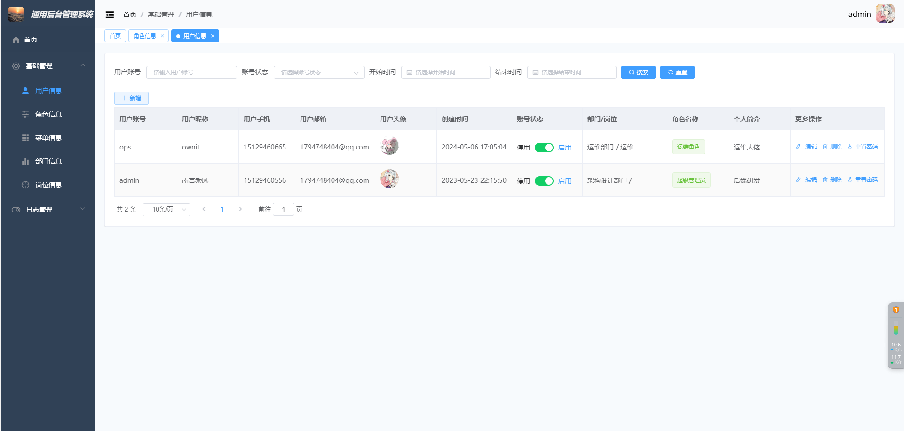
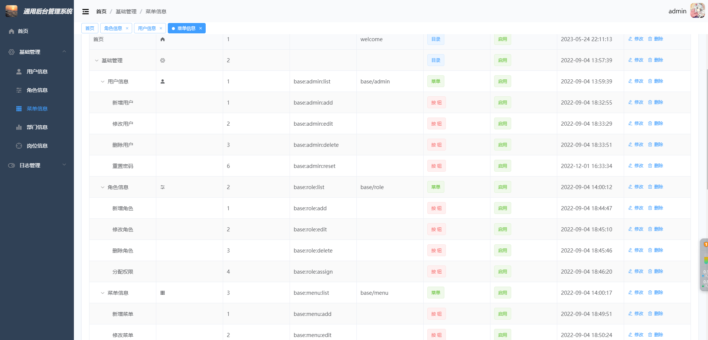
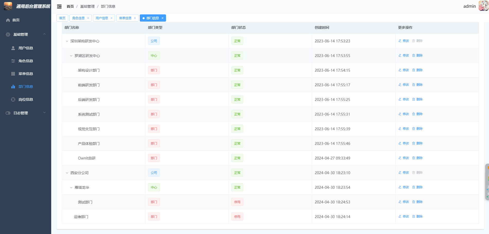
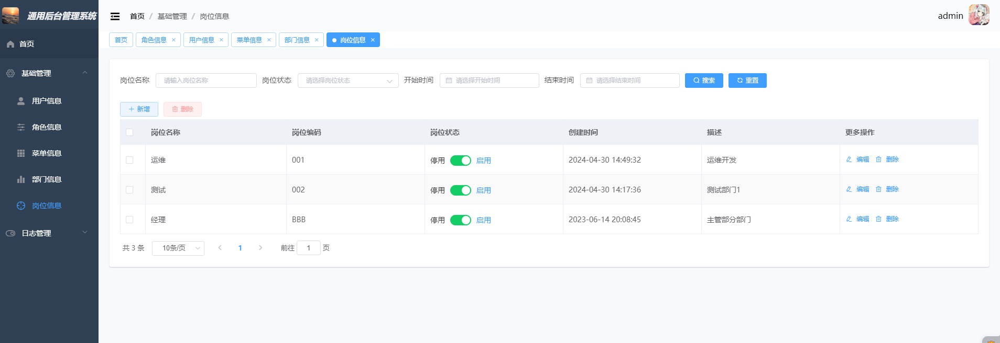
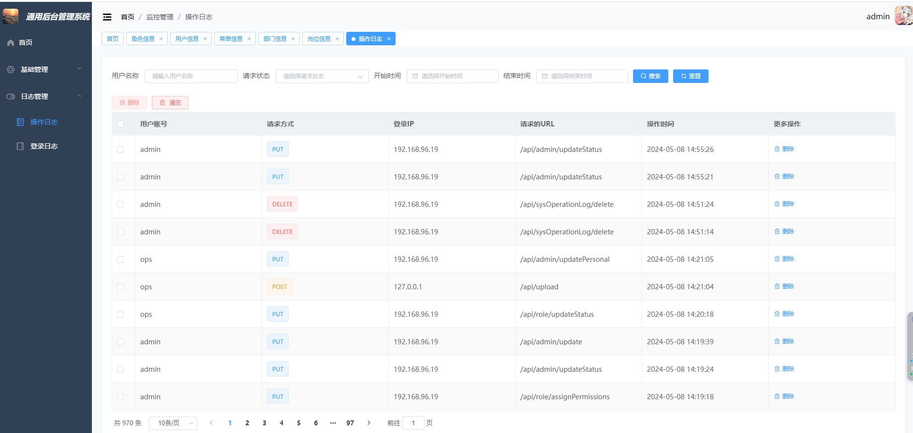
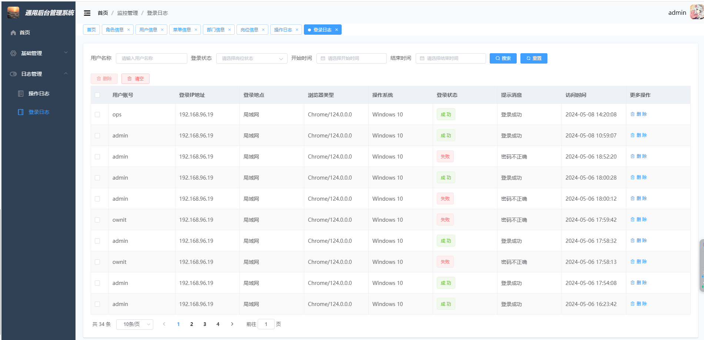
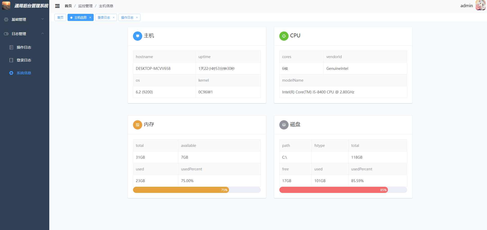

# admin-vue

## 项目简介

一个综合性的管理系统后端框架，主要包括以下核心功能：

1. **用户信息管理**：维护用户的基本信息，包括添加、编辑和删除用户，以及查看用户详情。支持用户状态管理，如激活、禁用等操作。
2. **角色信息管理**：定义不同的角色，并为每个角色分配相应的权限和责任。角色管理允许您精确控制用户可以访问和操作的系统部分。
3. **菜单信息管理**：配置和维护应用程序的导航菜单。这包括菜单的结构、显示逻辑、以及与角色权限的关联，确保用户界面的动态响应性和个性化。
4. **部门信息管理**：管理组织内各个部门的信息，支持部门的层次结构和部门之间的关系，为资源分配和权限管理提供结构化视图。
5. **岗位信息管理**：定义公司内的各种岗位职责和要求，岗位与员工的对应关系，以及岗位在组织内的级别和分类。
6. **操作日志记录**：记录用户在系统中的各项操作，包括时间、操作类型、操作内容和操作者信息。这对于审计、回溯和监控系统使用情况至关重要。
7. **登录日志记录**：跟踪用户的登录详情，如登录时间、IP地址和登录结果，增强系统的安全性和帮助识别非授权的访问尝试。
8. **个人信息管理**：允许用户查看和更新他们自己的个人资料信息，如联系方式、密码和个人设置。

 这个项目通过提供全面的管理功能，使得组织能够有效地管理其人员和资源，同时通过详细的日志记录功能增強了安全性和透明度。 

##  项目技术栈

前端项目如下，后端项目地址：[https://github.com/nangongchengfeng/admin-go-api.git](https://github.com/nangongchengfeng/admin-go-api.git)

**Vue.js**：一个渐进式JavaScript框架，用于构建用户界面。Vue的核心库只关注视图层，易于学习且集成程度高，非常适合在Vue上构建单页面应用。

**Axios**：一个基于Promise的HTTP客户端，用于浏览器和node.js，提供了一种简单有效的方式进行HTTP请求。

**Element UI**：一个为开发者、设计师和产品经理准备的基于Vue 2.0的桌面端组件库，提供了一套完善的组件，可以快速构建网站应用。

**ECharts**：一个使用JavaScript实现的开源可视化库，提供丰富的图表类型，广泛用于数据可视化领域。

**Vue Router**：Vue.js的官方路由管理器，用于构建单页面应用。Vue Router非常容易与Vue.js核心深度集成。

**Vuex**：Vue.js的状态管理模式和库，它采用集中式存储管理应用的所有组件的状态，并以相应的规则保证状态以一种可预测的方式发生变化。

**Vue Treeselect**：一个基于Vue的多选框组件，支持选择单个或多个选项，搜索选项，异步加载选项等。

 这些技术的组合为前端项目提供了全面的解决方案，支持从UI设计到状态管理，再到客户端与服务器的通信，确保应用程序的高效性和可维护性。 

## 安装

```
npm install
```

### 运行
```
npm run serve
```

### 打包
```
npm run build
```

### 项目目录


```tree
└─src
    ├─api 后端接口，统一管理
    ├─assets  静态文件和图片
    ├─components  组件
    ├─permission  权限
    ├─router 路由管理
    ├─store 存储管理
    ├─utils 工具类
    └─views 页面
```


## 安装依赖

```vue
安装vue-router： npm install vue-router@3.0.0 --save
安装element-ui: npm install element-ui@2.15.6 --save
安装vuex：npm install vuex@3.6.2 --save
安装axios：npm install axios@0.27.2 --save
安装sass：npm install node-sass@7.0.3 -D npm install sass-loader@13.0.2 -D
安装less：npm install less@4.1.1 --save npm install less-loader@8.0.0 --save
安装echarts：npm install echarts@5.1.2 --save
安装vue-treeselect ：npm install --save @riophae/vue-treeselect
```

### 运行展示











